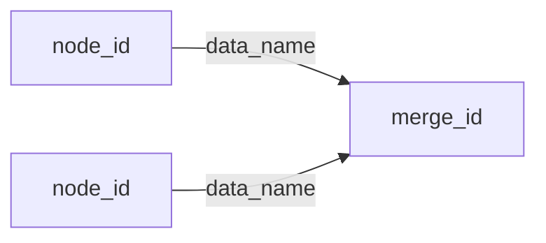

# Execution graph

> Fill this shape in nawab **§19** (in-plan preview) and copy it to
> `EXECUTION_GRAPH.md` on nawab-plan approval (or when graph-engineering
> is named against an already-approved plan). Then **run immediately**.

---

## Metadata

| Field | Value |
|-------|-------|
| **Source plan** | [path to IMPLEMENTATION_PLAN.md] |
| **Objective** | [one sentence from nawab §1] |
| **Topology mix** | chain / diamond / pipeline / conditional / cycle / mix |
| **Graph-engineering** | named — approving the nawab plan writes this file and starts execution |

---

## Mermaid

Draw **only real edges** (data actually crosses). Independent nodes have no arrow between them.

---

## Nodes

| ID | Job (one sentence) | Input schema | Output schema | subagent_type | Model | Write paths | Isolation |
|----|---------------------|--------------|---------------|---------------|-------|-------------|-----------|
| N1 | … | `{ ... }` or `none` | `{ ... }` | explore / generalPurpose / lead | cheap / inherit | none / globs | path-ownership |

Rules:

- One job per node. Bounded in, bounded out.
- Inputs passed explicitly — never assumed from a shared window.
- `cheap` = extract/classify (`composer-2.5-fast`). Merge/judge = `inherit`.
- Parallel writers: disjoint write paths. Overlap → sequence, do not fan out.
- Isolation default: nawab one-writer-per-path. Cloud worktree only if the user asked.

---

## Edges

| From | To | Data name | Kind |
|------|----|-----------|------|
| N1 | Merge | `items[]` | plumbing / agent / verify |

Kind:

- **plumbing** — lead code (flatten, dedupe, filter). No Task.
- **agent** — judgment or synthesis. Spawn a Task.
- **verify** — must survive a checker before it may flow downstream.

If you cannot name the data, there is no edge. Cut it.

---

## Waves

| Wave | Nodes | Fan-out? | Barrier? | Lead plumbing |
|------|-------|----------|----------|---------------|
| 0 | N1, N2, N3 | yes — one message, N Tasks | no | — |
| 1 | Merge | no | yes — needs whole set | `flatMap` + dedupe by `url` |
| 2 | Verify* | yes — one Task per finding | no | drop failed / null |

Same-wave nodes are independent. Do not wait across a fake "and then".

---

## Failure

- A Task that throws or returns empty → treat as **null**, drop it, continue the wave.
- Fan-in **tolerates missing inputs**. Do not assume a full set.
- Cycle `seen` keys: `[stable key formula, e.g. title+url]`. Dedupe against **everything seen**, not only confirmed.
- Dry stop: **2** consecutive rounds with no fresh keys vs `seen`.

---

## Commit mapping

| Node(s) | §9 row | Gate |
|---------|--------|------|
| N1 | # | `[repo command]` |

Git discipline is unchanged: one matrix row per commit, lead commits, ponytail on every write.

---

## Approval implication

Approving the **nawab plan** (this graph lives in §19) writes `EXECUTION_GRAPH.md` and **starts graph execution immediately**. There is no second wait.
