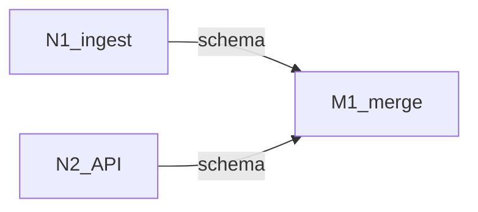

# Loop graph

> **This is the plan you read.** Loop plans are separate files; every one
> must appear as a markdown link in [Loop plans](#loop-plans).
>
> Fill this shape in nawab **§19** and write it to `LOOP_GRAPH.md`.
> On approval, **run immediately** ([EXECUTE.md](EXECUTE.md)).
>
> XOR: do not also fill graph-engineering `EXECUTION_GRAPH.md`.

---

## Metadata

| Field | Value |
|-------|-------|
| **Scope plan** | [IMPLEMENTATION_PLAN.md](IMPLEMENTATION_PLAN.md) (nawab §0–§18) |
| **Objective** | [one sentence] |
| **Topology mix** | chain / diamond / pipeline / conditional / cycle / mix |
| **Depth** | 2 (graph → loop plans). No nested graphs unless re-invoked. |
| **Graph-of-loops** | named — approving this graph starts execution |
| **Graph-engineering** | not loaded (XOR) |

---

## Loop plans

**Required.** Every node has a row. Links must resolve (write the files
before asking for approval). Each plan **must** name a stop command.

| ID | Name | Plan | Stop | Max rounds | Status |
|----|------|------|------|------------|--------|
| N1 | ingest core | [plans/loops/N1.md](plans/loops/N1.md) | `[cmd]` | 3 | pending |
| N2 | API | [plans/loops/N2.md](plans/loops/N2.md) | `[cmd]` | 3 | pending |
| M1 | merge / harden | [plans/loops/M1.md](plans/loops/M1.md) | `[cmd]` | 3 | pending |

Default directory: `plans/loops/<id>.md` next to `LOOP_GRAPH.md`.
State: `plans/loops/<id>.state.json`.

Loop status: `pending` / `looping` / `passed` / `escalated`.

---

## Lifecycle

Every full one-shot lists these stages. `N/A` needs a reason. Catalog:
`.cursor/skills/graph-of-loops/CYCLE.md`.

| Stage | Node id(s) | Plan / N/A |
|-------|------------|------------|
| Research + questions | R0 | lead (Gate 0 done; skill `QUESTIONS.md`) |
| Product lock | P0 | [plans/loops/P0.md](plans/loops/P0.md) |
| Docs-in | D0 | [plans/loops/D0.md](plans/loops/D0.md) |
| Architecture | A1 | [plans/loops/A1.md](plans/loops/A1.md) |
| Design / UI UX | U1 | [plans/loops/U1.md](plans/loops/U1.md) or `N/A — …` |
| Build | B* | links |
| Integrate | M1 | [plans/loops/M1.md](plans/loops/M1.md) |
| Evaluate | E1 | [plans/loops/E1.md](plans/loops/E1.md) |
| Run | R1 | [plans/loops/R1.md](plans/loops/R1.md) |
| Trials | T1 | [plans/loops/T1.md](plans/loops/T1.md) — queue in plan |
| Docs-out | D1 | [plans/loops/D1.md](plans/loops/D1.md) |
| Harden | H1 | [plans/loops/H1.md](plans/loops/H1.md) or `N/A — …` |

Software graphs **must** include P0, A1, E1, R1, T1, D1. Inner checkers do
not replace **Run** or **Trials**.

---

## Mermaid

Draw **only real edges**. Independent nodes have no arrow between them.

---

## Nodes

| ID | Job | Plan | Stop | Maker | Checker | Max rounds | Write paths |
|----|-----|------|------|-------|---------|------------|-------------|
| N1 | … | [N1](plans/loops/N1.md) | `[cmd]` | inherit | composer-2.5-fast | 3 | `packages/ingest/**` |

Rules:

- One job per node. The maker loads **its loop plan only**.
- Checker is a **different** Task and is readonly.
- Inputs passed explicitly.
- Parallel makers: disjoint write paths.

---

## Edges

| From | To | Data name | Kind |
|------|----|-----------|------|
| N1 | M1 | `schema` | plumbing / agent / verify |

- **plumbing** — lead code. No Task, no loop plan.
- **agent** — judgment. The downstream **loop plan** consumes the artifact.
- **verify** — must **pass** before it may flow on.

If you cannot name the data, there is no edge. Cut it.

---

## Waves

| Wave | Nodes | Fan-out? | Barrier? | Status | Lead plumbing |
|------|-------|----------|----------|--------|---------------|
| 0 | [N1](plans/loops/N1.md), [N2](plans/loops/N2.md) | yes | no | pending | — |
| 1 | [M1](plans/loops/M1.md) | no | yes — whole set | pending | `flatMap` + dedupe |

Wave `Status`: `pending` / `running` / `done` / `partial`.
A wave is `done` only when every node in it is `passed` (or dropped null).
`escalated` blocks dependents. Resume at the first non-`done` wave; inside
a `looping` node, resume from `state.json` round.

---

## Failure

- Checker fail + rounds left → next maker round with findings only.
- `max_rounds` exhausted → `escalated`, wait for human. Do not start
  dependents.
- Task throw/empty on a fan-out sibling → **null**, drop, continue the wave
  **only if** that node is optional. Required nodes escalate.
- Fan-in tolerates missing **optional** inputs only.

---

## Commit mapping

| Node | Plan | §9 rows | Gate |
|------|------|---------|------|
| N1 | [N1](plans/loops/N1.md) | #–# | `[stop command]` |

Lead commits after the loop **passed**. Ponytail on every write. One matrix
row per commit. Subagents do not commit.

---

## Approval implication

Approving **this loop graph** (nawab plan with §19 filled as graph-of-loops)
starts execution immediately. Loop plans are already written and linked. No
second wait, and no wait per node unless a loop **escalates** or marks a
human checkpoint (prod / freeze).
