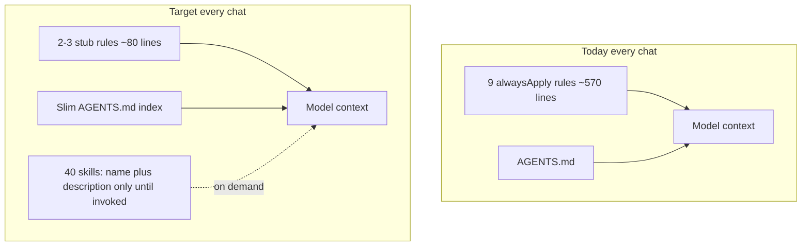
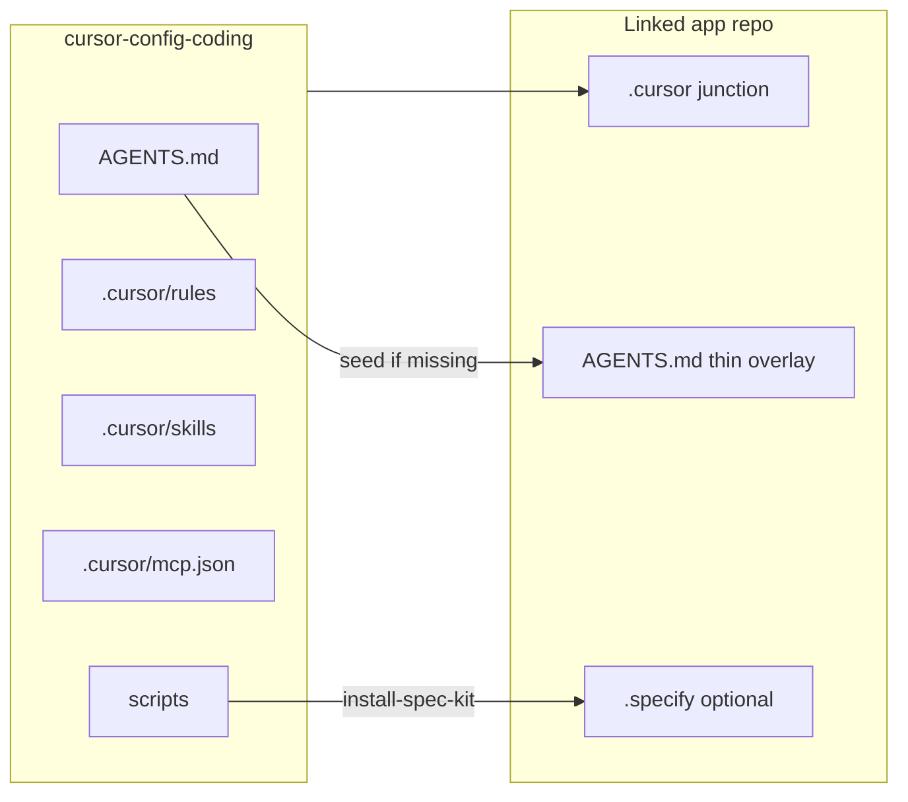

# Config repo 2026 audit — IMPLEMENTATION_PLAN

> Approved execution contract. Source: nawab plan (feature mode). Do not treat Cursor `.plan.md` as writable authority.

**Status:** complete on `cursor/config-2026-audit` (2026-09-11). Gate: `.\scripts\validate-config.ps1` exit 0. Inventory later slimmed to **30** skills (2026-09-14); this file is the 2026-09-11 audit contract.

**Portability (user correction during G):** skill bodies describe jobs, not named products or private gold repos. Corpus in §1 remains research evidence for *this* audit only.

---


# Config repo 2026 audit — Master Execution Plan

> Nawab master plan — feature-mode modernization of this Cursor config distro.
> **Mode:** feature (existing repo; no app runtime)
> **Pulled:** `main` @ `e6ad09e` already matched `origin/main` (ff-only pull, 2026-09-10).
> **Intensity (user):** token-first always-on slim, plus **skill-body rewrites** from real artifacts (nawab plans + READMEs), not frontmatter-only hygiene.
> **Corpus:** `C:\Users\vinay\.cursor\plans\` (199 files); Stamped `L1-L6` plans; **`D:\Tech` gold READMEs** (Improveness, Chatbot-api, Unagent); Stamped L2–L6 readable/EXTENSIVE.

---

## §0 Plan metadata

- **Mode:** feature
- **Stack:** Cursor config (rules `.mdc`, Agent Skills `SKILL.md`, PowerShell, Markdown). No app runtime, no `package.json`.
- **Base branch:** `main`
- **Feature branch:** `cursor/config-2026-audit`
- **Authority docs:** [AGENTS.md](AGENTS.md), [README.md](README.md), [skills-manifest.json](skills-manifest.json), [docs/INDUSTRY_PRACTICES.md](docs/INDUSTRY_PRACTICES.md), Cursor [Rules](https://cursor.com/docs/rules) + [Skills](https://cursor.com/docs/skills), Spec Kit [v1.0.6](https://github.com/github/spec-kit/releases/tag/v1.0.6)
- **Estimated commits:** 16–18 (config + two skill-family rewrites; user commit budget not capped)
- **Lead agent:** orchestrate, edit, commit, integrate subagent returns; no subagent git

---

## §1 North star & scope boundary

### Objective

Linked coding projects get **lean always-on context** and skills whose **bodies match how Vinayak actually plans and documents** — nawab that does not pad 18 sections onto a 6-commit UI pass, READMEs that teach concepts before folder maps — plus 2026 Cursor hygiene (AGENTS.md seed, Spec Kit v1.0.6).

### Deliverables

- Always-on rules cut from **9 files / ~570 lines** to **2–3 stubs / ~80 lines**; `planning.mdc` becomes **profile-aware** (lite / standard / project), not “always 18 sections”
- **nawab-plans rewrite** from the saved-plan corpus: SKILL.md, PLAN.template.md, new `PLAN.template.lite.md`, SUBAGENT_ORCHESTRATION.md short-form default
- **readme / readable-readme / extensive-readme / product-readme rewrite** from **`D:\Tech` gold landings** (Improveness, Chatbot-api, Unagent) plus Stamped L2–L6 internals; merge global `~\.cursor\skills` wording that is ahead
- Skill hygiene: DMI / `paths` / descriptions; slim graphify; fix `premium-frontend-ui`
- Spec Kit pin **v0.12.11 → v1.0.6**
- Link script seeds thin root `AGENTS.md`; `scripts/validate-config.ps1`

### Non-goals

- Deleting skill folders from this repo (files stay)
- Rewriting graph-engineering product behavior (keep opt-in; only a graphify disambiguation line in nawab)
- Companion repos (`cursor-config-buisness`, `cursor-config-design`)
- Rewriting all 40 skill bodies in depth (P0 = nawab + README family; other skills get frontmatter/hygiene + a light pass for broken refs, not a second architecture treatise)
- Preinstalling Vercel React BP / frontend-design (catalog only)
- Default-on `.cursor/hooks.json`
- Creating fake `PROJECT_OVERVIEW.md` in this config repo
- Back-porting new skills into already-written Stamped READMEs (those repos already concept-first; skills catch up)

### Priority

- **P0:** always-on slim; **nawab profiles from corpus**; **concept-first README skills**; AGENTS.md link; Spec Kit v1.0.6
- **P1:** GSAP/graphify DMI; remaining-skill light pass; catalog refresh; hooks example; Unix link helper

---

## Audit findings (why this plan exists)

**Context tax (the actual 2026 problem).** Cursor injects `alwaysApply: true` rules into every chat. This repo ships **~570 always-on lines** plus a long [AGENTS.md](AGENTS.md). [docs/INDUSTRY_PRACTICES.md](docs/INDUSTRY_PRACTICES.md) already says “thin always-on rules (<50 lines each)” — the repo violates itself. Worst file: [communication.mdc](.cursor/rules/communication.mdc) (~210 lines). Duplicate workflow lives in planning + communication + learn-and-research + documentation + quality-gates + execution.

**Rules vs skills (Cursor 2026).** Official docs: rules = short invariants; skills = multi-step procedures, progressive disclosure, `disable-model-invocation` for slash-only, `paths` to scope. `/migrate-to-skills` exists for dynamic rules. Nested `AGENTS.md` is supported. This plan moves procedures out of always-on rules into skills (already written).

**Skills inventory.** 40 directories (glob “42” was path-separator double-count). Only **graph-engineering** has `disable-model-invocation: true`. graphify is 964 lines, frontmatter `name: graphify-windows` (must match folder). Niche GSAP + graphify stay on disk; DMI so they do not auto-compete.

**Spec Kit.** Pinned **v0.12.11**; upstream **v1.0.6** (2026-09-10). CLI now uses `--integration cursor-agent` (already in the script) but docs/skills were generated from 0.12.11. `speckit.taskstoissues` is scheduled to leave core — keep skill, document as legacy.

**Linking hole (critical).** Junction copies `.cursor` only. `rule-awareness` step 1 is “read AGENTS.md at project root.” Linked apps do not get it unless they copy by hand. Script already says “keep project-specific notes in `$Target\AGENTS.md`” but never seeds the file.

**Popular 2026 skills (do not preinstall blindly).** Ranked lists: Anthropic `frontend-design`, Vercel `vercel-react-best-practices` (~467k, already in [skills-manifest.json](skills-manifest.json) optional), `find-skills`, `web-design-guidelines`, `agent-browser`. This repo already has `impeccable` + `nextjs-app-router-patterns` + `find-skills`. **Catalog + recommend**, do not add 5 more always-discoverable skills.

### Nawab corpus (199 Cursor plans + Stamped)

Source: `C:\Users\vinay\.cursor\plans\` plus `D:\Startups\Stamped_Energy\L1-L6\.cursor\plans` and `docs\plans`.

- Only **~16%** of saved plans are nawab-shaped (§0+§1+§9). **~83%** stay Cursor `overview` + `todos`. Full §0–§18 appears in **~14%**.
- Agents **delete headings** instead of writing `N/A — reason`. Heading drift: `§1 North star` vs `& scope boundary` vs `and scope`.
- Commit fights are the main churn: first draft inflates toward 18–28 rows; user or a second plan coalesces to **6 or 8** (`study_files_ux`, `handoff_ui_agent_model` 26→8, `readme_skills_dual` = 2). Skill already says user count wins — it is **too far down** the page.
- Duplicate UUID plans with no `Supersedes:` field. Authority lives in `~\.cursor\plans\`, almost never copied to repo `IMPLEMENTATION_PLAN.md`.
- §6 spawn maps are ceremonial except on huge handoff audits. `isProject: true` vs Mode feature mismatch.
- Bloat: `agent-platform-blueprint` is **578 lines for 3 doc commits**; `study_files_ux` is **457 lines for 6 commits**.
- Good counterexample: Stamped holistic pack (`00_MASTER.md` + child plans + `99_AUDIT_ponytail_nawab.md`) — **project profile** with real gates. That is what full nawab is for.
- `planning.mdc` “all 18 sections compulsory” is why agents either **pad** or **ignore**. Fix the skill **and** the rule together.

**Nawab rewrite (locked):**

- Profiles: **lite** (§0, §1, §9, §16, §18) · **standard** (lite + §2, §3, §7, §10, §11) · **project** (full §0–§18)
- Cursor Plan mode **defaults to lite** unless user says full nawab / project / multi-package
- §0 asks **commit budget before §9**; user number overrides 7–8 / 18+ tables
- `Supersedes:` + `Delivery: cursor-plan | repo IMPLEMENTATION_PLAN`
- §6 N/A allowed for lead-only; SUBAGENT long contract is project-only
- Docs/README work class: concept outline before file paths
- `PLAN.template.lite.md` + slim SKILL.md (move duplicated tables into templates)

### README corpus (Tech gold + Stamped layers)

**Latest-skill gold (`D:\Tech`) — these are the READMEs to copy as a shape, not Stamped’s numbered 7-section skeleton.**

- [`D:\Tech\Improveness\README.md`](D:\Tech\Improveness\README.md) — best: centered logo/badges, what it is / is not, **primary interface + invariant**, one **proof command** (`qa.sh`) in the first screen, era context with named papers, **Core techniques** (each with a limit + verified link), a **field guide** that teaches vocabulary without `### 2.1 The problem / Like / Limits` blocks, honest claims table (claim ledger), Get started, Go deeper. No `## 1. Vision` numbering.
- [`D:\Tech\Chatbot-api\README.md`](D:\Tech\Chatbot-api\README.md) — same family, shorter: curl demo first, four named techniques, one mermaid, real install.
- [`D:\Tech\superdeterminisiom\README.md`](D:\Tech\superdeterminisiom\README.md) (Unagent) — **demo-first**: ABSTAIN as a first-class product result; Wilson / cassette honesty before Get started.
- [`D:\Tech\MDG-WEBSITE\README.md`](D:\Tech\MDG-WEBSITE\README.md) — thin product landing for a site (one core idea + `npm run dev`).
- **Do not copy:** [`D:\Tech\local-ai-collab-cloud-agent\README.md`](D:\Tech\local-ai-collab-cloud-agent\README.md) — blueprint stub, not a skill success.
- Tech `docs/EXTENSIVE.md` (Improveness, Unagent) still opens **how-it-runs → package map → ideas at §6** — the *landing* improved; extensive templates did not. Keep Stamped L2–L6 EXTENSIVE as the concept-first internals target.

**Stamped L2–L6** remains the gold for **internal platform-layer** readable READMEs (7 sections, EXTENSIVE banner, concept-heavy §2 after the concept-first plan). Different job from an installable OSS/agent landing.

**Router implication (locked):**

- Installable product / OSS / agent / library → default **product-readme** (Improveness shape)
- Internal platform layer / monorepo service → default **readable-readme** (L2 shape)
- Unknown → still ask once, but the question should mention those two shapes
- Hybrid (Tool-Selection: logo then readable TOC) allowed when user wants both

**product-readme rewrite (locked):** bake Improveness section order into `templates.md` + a shortened `examples.md` (do not depend on `D:\Tech` at runtime). Required first screen: what/isn’t, primary interface, invariant, proof command or demo. Named techniques with **limits**. Forbid slogan claims. Optional field guide. Get started after the teaching.

**readable-readme rewrite (locked):** keep for platform layers; Phase 0 concept brief; cap ideas at 5; optional analogy; do **not** force this skeleton onto product repos.




---

## §2 Prerequisites & blockers

- Git pull — **done** (`Already up to date` at `e6ad09e`)
- Working tree — **done** (clean at plan time)
- Spec Kit v1.0.6 install in a temp dir to regenerate `speckit-*` — **pending**, blocks Phase C
- Network for `uv tool install specify-cli@v1.0.6` — **pending**, blocks Phase C
- User approval of this plan — **pending**, blocks all execution

No phase starts while approval is pending.

---

## §3 Authority & artifact map

- [AGENTS.md](AGENTS.md) — writable index (slim; pointers only)
- [IMPLEMENTATION_PLAN.md](IMPLEMENTATION_PLAN.md) — this plan, written after approval
- [PROGRESS.md](PROGRESS.md) — live status after approval (this *execution* may create it; app-doc rule will not require it in config forever)
- [DECISIONS.md](DECISIONS.md) — ADRs for always-on cut and Spec Kit bump
- [skills-manifest.json](skills-manifest.json) — inventory truth
- Saved plans (read-only): `C:\Users\vinay\.cursor\plans\`, Stamped `L1-L6\.cursor\plans`, `L1-L6\docs\plans`
- **Tech gold READMEs (read-only):** `D:\Tech\Improveness\README.md`, `D:\Tech\Chatbot-api\README.md`, `D:\Tech\superdeterminisiom\README.md`, their `docs/EXTENSIVE.md`
- Global skills (read-only merge source): `C:\Users\vinay\.cursor\skills\readme`, `product-readme`, `extensive-readme`
- Global skills (read-only merge source): `C:\Users\vinay\.cursor\skills\readme`, `product-readme`, `extensive-readme`
- Cursor docs / Spec Kit releases — read-only external
- `.specify/` in this config repo — do **not** create; Spec Kit lives in linked *app* repos

---

## §4 Architecture & system map




### Target layout (after)

- `.cursor/rules/` — same 21 files, different activation
- `.cursor/skills/` — same 40 folders; **nawab + README family bodies rewritten**; others DMI/paths/frontmatter
- `.cursor/skills/nawab-plans/PLAN.template.lite.md` — new
- `.cursor/hooks.json.example` — new, not default-on
- `scripts/validate-config.ps1` — new
- `scripts/link-to-project.ps1` — seeds AGENTS.md
- No new skill *count* unless Phase E catalog-only entries in JSON

### Trust boundaries

- No secrets. MCP stays URL-only default (agent-patterns). Optional Context7 stays in `mcp.json.example`.
- `specify init --force` on a junctioned `.cursor` **rewrites shared speckit skills** — Phase C must copy from a temp app dir, not run `--force` against this repo’s live `.cursor` blindly.

---

## §5 Workstreams

- **WS-A Context budget** — `.cursor/rules/*`, slim AGENTS.md. Lead. Phase A (planning.mdc profile text lands with Phase F).
- **WS-B Skill hygiene** — `.cursor/skills/*` except nawab/readme/speckit bodies. Lead. Phase B.
- **WS-F Nawab rewrite** — `nawab-plans/` + `planning.mdc` profile language. Lead. Phase F. Evidence: 199 saved plans.
- **WS-G README rewrite** — `readme`, `readable-readme`, `extensive-readme`, `product-readme`. Lead. Phase G. Evidence: **`D:\Tech` landings** + Stamped L2–L6 EXTENSIVE.
- **WS-C Spec Kit** — `speckit-*`, install script, SPEC_KIT.md. Lead. Phase C.
- **WS-D Linking & validate** — `scripts/*`. Lead. Phase D.
- **WS-E Docs & catalog** — README, docs/*, manifest, DECISIONS. Lead. Phase E.

Single-threaded on shared files (`AGENTS.md`, `planning.mdc`, `skills-manifest.json`, `README.md`).

---

## §6 Agent orchestration & subagent spawn map

**Parallel limit:** 2. Lead owns all writes and commits.

- **S1** — already run (explore rules). Integrated into this plan.
- **S2** — already run (explore skills). Integrated.
- **S3** — already run (explore docs/scripts). Integrated.
- **S4** Phase C — `explore` readonly: after temp `specify init`, diff new speckit skills vs ours. Sync: before Spec Kit commit.
- **S5** Phase N — `explore` readonly: always-on line count, manifest vs disk, nawab profile headings exist, README skill templates concept-first. Sync: before validate commit.
- **S6** Phase N — `ponytail-review` via lead on full diff. No security-review (no auth/runtime).
- **S7–S8** — already run this iteration (nawab corpus + README corpus). Integrated above. Do not re-scan all of `D:\Startups`.

Spawn S4 prompt contract: map regenerated Spec Kit skills vs `D:\Startups\Cursor\cursor-config-coding\.cursor\skills\speckit-*`; return breaking description/CLI diffs; do not edit.

---

## §7 Phase map & dependencies


- **0** Research — done (repo audit + 199 plans + Stamped READMEs). Exit: this document approved.
- **A** Always-on slim — WS-A. Exit: always-on ≤ ~100 lines.
- **B** Skill hygiene — WS-B. Exit: graphify name+DMI; dead link gone.
- **F** Nawab rewrite — WS-F. Exit: lite/standard/project in SKILL + lite template; planning.mdc matches; commit budget asked before §9.
- **G** README rewrite — WS-G. Exit: product-readme template matches Improveness first-screen order; router defaults by repo kind; extensive still concept-first for internals.
- **C** Spec Kit v1.0.6 — WS-C.
- **D** Link + validate — WS-D.
- **E** Docs/catalog — WS-E.
- **N** Hardening — all.

---

## §8 Todo registry

```yaml
todos:
  - id: approve-plan
    content: "User approves this nawab plan; copy to IMPLEMENTATION_PLAN.md"
    status: pending
  - id: phase-a-rules
    content: "Phase A: shrink always-on to 2-3 stubs; demote the rest"
    status: pending
  - id: phase-b-skills
    content: "Phase B: DMI/paths/descriptions; slim graphify; fix dead refs"
    status: pending
  - id: phase-f-nawab
    content: "Phase F: nawab lite/standard/project + templates + planning.mdc"
    status: pending
  - id: phase-g-readme
    content: "Phase G: product-readme = Improveness shape; readable = L2 layers; extensive concept-first"
    status: pending
  - id: phase-c-speckit
    content: "Phase C: regenerate speckit-* from v1.0.6; update install pin"
    status: pending
  - id: subagent-s4-speckit-diff
    content: "Spawn S4: diff regenerated speckit skills vs current"
    status: pending
  - id: phase-d-scripts
    content: "Phase D: seed AGENTS.md on link; add validate-config.ps1"
    status: pending
  - id: phase-e-docs
    content: "Phase E: README/docs/manifest/DECISIONS/INDUSTRY_PRACTICES"
    status: pending
  - id: phase-n-hardening
    content: "Phase N: validate script + ponytail-review + PROGRESS"
    status: pending
```

---

## §9 Commit matrix

Work class: major config + two skill-family rewrites → **16–18** commits.

### Phase A — always-on context

1. WS-A `refactor(rules): shrink always-on stubs and demote workflow rules` — stub rule-awareness + ponytail; demote communication, documentation, learn-and-research, architecture-boundaries. **Do not rewrite planning.mdc profiles here** (Phase F). Gate: always-on files ≤ 3 excluding planning if still true until F; after F planning is false or a 15-line stub. Agent: lead.
2. WS-A `refactor(agents): slim AGENTS.md to an index` — pointers only; mention nawab **profiles** in one line (detail in skill). Agent: lead.

### Phase B — skill hygiene

3. WS-B `fix(skills): align graphify name, DMI, and progressive disclosure` — `name: graphify`; DMI; CLI dump to `references/cli.md`; SKILL &lt; 150 lines. Agent: lead.
4. WS-B `fix(skills): DMI niche GSAP and one-shot ponytail; fix dead refs` — as previously specified; `premium-frontend-ui` → `impeccable`; `paths` on stack skills. Agent: lead.

### Phase F — nawab (corpus-driven)

5. WS-F `feat(nawab-plans): add lite/standard/project profiles and lite template` — SKILL.md: When to load uses profiles; Cursor Plan defaults **lite**; project keeps full 18; `PLAN.template.lite.md`; slim SKILL by pointing at templates instead of duplicating tables. Agent: lead.
6. WS-F `feat(nawab-plans): commit budget, supersedes, delivery surface` — §0 fields: User commit budget (ask before §9), Supersedes, Delivery (cursor-plan vs IMPLEMENTATION_PLAN), Profile. User count **at top** of §9 doctrine. Coalesce rule if matrix &gt; 2× budget. Anti-patterns: second plan to coalesce; 500-line plan for 3 commits. Agent: lead.
7. WS-F `refactor(nawab-plans): demote §6; align planning.mdc` — SUBAGENT_ORCHESTRATION short table default; full spawn contract appendix. planning.mdc: Plan mode must load nawab **at the chosen profile**, not “all 18 or you failed”. Docs work class: concept outline before paths. graphify ≠ §19. Agent: lead.

### Phase G — README skills (Tech gold + Stamped layers)

8. WS-G `feat(product-readme): Improveness-shaped landing template` — first screen: logo optional, what/isn’t, primary interface, invariant, proof command or recorded demo. Then why/era, named techniques with limits, optional field guide, honest claims, Get started, Go deeper. Add a shortened example distilled from Improveness/Chatbot-api/Unagent (no `D:\Tech` path in the skill). Agent: lead.
9. WS-G `feat(readable-readme): keep for platform layers; concept brief; cap ideas at 5` — do not apply 7-section numbering to product repos. Optional analogy. Futures short; no copy into EXTENSIVE. Agent: lead.
10. WS-G `feat(readme): route by repo kind; extensive concepts-before-map; sync global` — installable/OSS/agent → product; platform service → readable; unknown → one AskQuestion naming both shapes. Extensive: how-it-runs + domain concepts before package map (fix Tech EXTENSIVE lag). Merge global “product landings teach.” Allow Tool-Selection hybrid. Agent: lead.

### Phase C — Spec Kit

11. WS-C `chore: regenerate speckit skills from github/spec-kit@v1.0.6` — temp specify init; copy speckit-* only. Agent: lead + S4.
12. WS-C `fix(scripts): pin install-spec-kit.ps1 to v1.0.6` — flags and junction warning. Agent: lead.

### Phase D — linking

13. WS-D `feat(scripts): seed thin AGENTS.md when linking a project` — `templates/AGENTS.overlay.md`; never overwrite rich AGENTS.md. Agent: lead.
14. WS-D `feat(scripts): add validate-config.ps1` — skill count, always-on budget, pin match, nawab lite template exists, no “19 .mdc”. Agent: lead.

### Phase E — docs

15. WS-E `docs: align README, SPEC_KIT, TECH_STACK, INDUSTRY_PRACTICES` — counts, v1.0.6, nawab profiles, concept-first README note. Agent: lead.
16. WS-E `docs: rewrite documentation.mdc for app repos; DECISIONS + catalog` — ADRs for always-on cut, nawab profiles, README concept-first, Spec Kit bump. Agent: lead.

### Phase N — validation

17. all `test: run validate-config and ponytail-review fixes` — Gate: script exit 0. Agent: lead.
18. all `docs: PROGRESS.md and IMPLEMENTATION_PLAN.md complete` — only if 1–17 green. Agent: lead.

---

## §10 Test & CI strategy

This repo has no Node test runner. Gates are scripts + grep.

- **Fast (every commit):** targeted grep (alwaysApply true count; pin strings; dead skill name)
- **Medium (phase end):** `.\scripts\validate-config.ps1`
- **Slow:** N/A (no E2E app)

**CI:** no GitHub Actions today. P1 only — do not add CI unless validate script is trivial YAML. Default: skip CI workflow (YAGNI for a config repo).

**Test locations:** `scripts/validate-config.ps1` is the orchestrator.

---

## §11 Research log & decisions

- **Always-on vs skills** — Options: keep 9 always-on / token-first slim / max-delete skills. **Choice: token-first** (user). Source: Cursor rules docs; [INDUSTRY_PRACTICES.md](docs/INDUSTRY_PRACTICES.md); create-skill (descriptions + DMI). Record in DECISIONS.md.
- **Spec Kit pin** — stay on 0.12.11 vs jump to 1.0.6. **Choice: v1.0.6**. Source: [github/spec-kit releases](https://github.com/github/spec-kit/releases) (v1.0.6 on 2026-09-10). `--ai` removed; skills mode is default for cursor-agent.
- **Popular skills** — preinstall Vercel React BP + frontend-design vs catalog. **Choice: catalog + recommend**. Avoid growing the auto-discovery list. Manifest already lists vercel-react-best-practices.
- **AGENTS.md for linked apps** — junction-only vs seed overlay. **Choice: seed if missing**. rule-awareness requires root AGENTS.md.
- **documentation.mdc four files** — add empty PROJECT_OVERVIEW to this repo vs scope the rule to apps. **Choice: scope to apps**. This repo’s overview is README.
- **Hooks** — default hooks.json vs example. **Choice: example only** (README already: “Not hooks-enforced by default”).
- **graph-engineering** — not requested this session. §19 N/A.
- **Nawab profiles** — keep forcing 18 sections vs lite/standard/project. **Choice: profiles.** Evidence: 199 plans, 16% full nawab; user 6/8 commit caps. Record in DECISIONS.md.
- **README gold** — 7-section readable vs Improveness product landing. **Choice: product-readme is the default for installable/agent/OSS (Tech gold); readable-readme stays for internal platform layers (Stamped L2–L6).** Evidence: `D:\Tech\Improveness`, `Chatbot-api`, `superdeterminisiom`. Extensive: concepts before package map (Stamped internals beat Tech EXTENSIVE).

---

## §12 Documentation & artifact sync

- Plan approved → write `IMPLEMENTATION_PLAN.md` (this content), start `PROGRESS.md`
- Phase complete → `PROGRESS.md` + short `PHASE_*_COMPLETION.md` under `docs/` (keep light; this is a config repo)
- Arch choice → `DECISIONS.md`
- Cutover → N/A (no consumer switch); linked apps pick up on next Cursor reload after re-link

---

## §13 Quality gates & checkpoints

- Phase A done — alwaysApply true ≤ 3 files (or 4 if planning stub still true until F)
- Phase B done — graphify `name: graphify` + DMI; no `premium-frontend-ui`
- Phase F done — `PLAN.template.lite.md` exists; SKILL.md names lite/standard/project; planning.mdc is profile-aware
- Phase G done — product-readme template has proof-command + named-techniques-with-limits; router mentions product vs readable by repo kind; extensive templates do not lead with package map
- Phase C done — all pins `v1.0.6`
- Phase D done — AGENTS.md seed + validate script
- Phase E done — README counts match disk
- Hardening — `validate-config.ps1` exit 0
- **Human:** approval of this plan before Phase A; Cursor reload reminder after merge (user action)

---

## §14 Validation & hardening

1. Static: always-on budget, secret scan (should be none), no Windows-only paths in SKILL.md bodies where we touch them
2. validate-config.ps1
3. Adjacent: speckit.mdc still points at nawab/ponytail precedence
4. ponytail-review on full branch diff (lead)
5. speckit-converge N/A (no `.specify/` here)
6. Manual: confirm Plan mode still instructed to load nawab via demoted planning.mdc description + AGENTS.md

**Orchestrator:** `scripts/validate-config.ps1`

---

## §15 Rollout & cutover

N/A — no production consumer switch.

Operational note: projects already junctioned pick up rule/skill edits automatically. They need a **new AGENTS.md seed only if missing** — document “re-run link or copy `templates/AGENTS.overlay.md`”. Reload Cursor after pull.

---

## §16 Exit criteria

### P0

- Always-on rule files ≤ 3, combined body ≲ 100 lines
- Plan mode routes to nawab **at a named profile** (lite default; project still full)
- nawab SKILL asks commit budget before §9; user count overrides defaults
- product-readme first screen matches Tech gold (what/isn’t, interface, invariant, proof/demo)
- readable-readme: concept brief + ≤5 ideas (platform layers only)
- extensive: how-it-runs + concepts before package map
- router defaults: product for installable/OSS/agent; readable for internal platform layers
- Ponytail still required before code
- Linked-app AGENTS.md seeded when absent
- Spec Kit pin is v1.0.6
- `validate-config.ps1` exits 0
- README does not say “19 .mdc files”

### P1

- Unix/macOS link helper
- GitHub Actions wrapping validate-config
- Preinstall vercel-react-best-practices (rejected unless user later asks)

---

## §17 Risks & contingencies

- **Nawab “forgotten” after demoting planning.mdc** — Mitigation: AGENTS.md + profile-aware planning.mdc + skill. Contingency: 15-line always-on planning stub that only says “load nawab at the matching profile.”
- **Lite profile too thin for Stamped-scale work** — Mitigation: project profile still full 18; holistic master+child pattern stays valid. Contingency: user says “full nawab.”
- **specify init --force clobbers custom skills** — copy speckit-* from temp project only.
- **Global vs repo skill drift** — Phase G merges into **repo**; `~/.cursor/skills` may stay stale until user recopies. Document in README.
- **Junctioned apps still load all 40 skill descriptions** — DMI on bodies only.
- **User-rule git conflict** — this repo’s git-commit-discipline stays proactive.

---

## §18 Execution protocol (post-approval)

```text
1. Load this plan + nawab-plans; ponytail on every edit
2. Branch cursor/config-2026-audit from main
3. Write IMPLEMENTATION_PLAN.md + PROGRESS.md
4. For each phase in §7 (A → B → F → G → C → D → E → N):
   a. Sync §8 todos
   b. S4 only at Phase C
   c. Each §9 row: implement → gate → conventional commit (no push unless ≥10 unpushed or user asks)
   d. PHASE note + PROGRESS
5. Phase N: validate-config.ps1 + ponytail-review
6. Verify §16 P0 → report hash + unpushed count
```

§19 is N/A — do not load graph-engineering.

---

## §19 Execution graph

N/A — graph-engineering not requested.

---

## Open questions

- None blocking. Intensity: **token-first + corpus-driven skill rewrites**. Spec Kit **v1.0.6**. Nawab **lite default**. README: **Improveness product landing for products; L2 readable for platform layers**.

## Approval

**Mode:** feature  
Plan ready. Approve to begin **Phase A**.  
Lead follows **§18**. No graph run.
