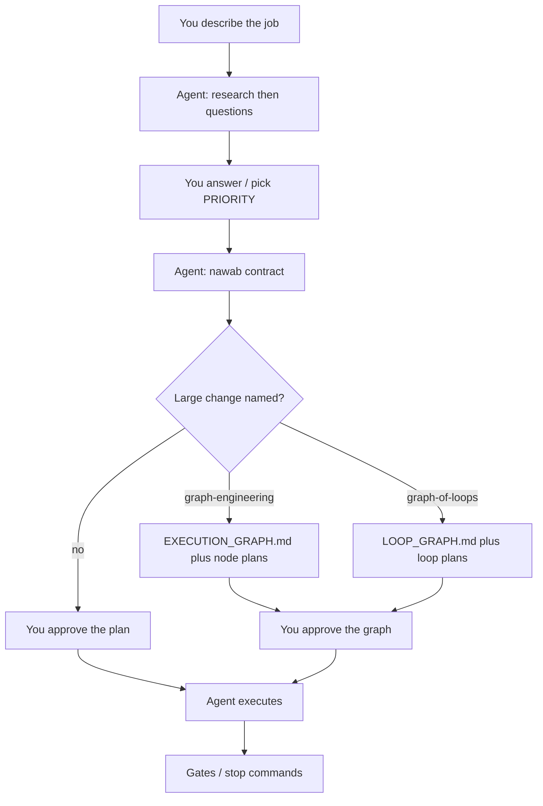

<p align="center">
  
</p>

<h1 align="center">
  
</h1>

<p align="center">
  <strong>The first portable engineering lab for Cursor.</strong>
</p>

<p align="center">
  <a href="#quick-start"><b>Quick start</b></a> ·
  <a href="#always-on-context"><b>Context</b></a> ·
  <a href="#planning-stack"><b>Planning stack</b></a> ·
  <a href="#try-these-prompts"><b>Try these prompts</b></a> ·
  <a href="docs/EXTENSIVE.md"><b>Internals</b></a>
</p>

> Full internals (every package, file map, how the repo runs): [Extensive README](docs/EXTENSIVE.md)

Turn Cursor into a plan-then-ship engineering workflow. **30 skills**, **21 rules**.

You keep every product and architecture decision. The agent writes the plan, stops, and waits. You approve. Then it executes. Describe the job in plain language.

> **cursor-config-coding is an engineering lab you can junction today.** It is not a PM or GTM config.
> Primary interface: a prompt in Cursor after `link-to-project.ps1`.
> Invariant: **humans decide; the agent plans, waits, then executes.**

## Proof

This is the inventory check, not `--help`. It counts the 30 skills, the three always-on rules, and the Spec Kit pin.

```text
$ .\scripts\validate-config.ps1
ok  : skill count 30
ok  : always-on rules: ai-anti-patterns, ponytail, rule-awareness
ok  : always-on lines 51 (<= 120)
ok  : Spec Kit pin v1.0.6 in script/manifest/source
ok  : nawab PLAN.template.lite.md exists
ok  : skills have no named-gold-repo strings

validate-config: all checks passed.
```

## The bet

Most Cursor configs dump rules and hope the model "just builds." This lab splits the control loop the other way:

| Seat | Owns |
|------|------|
| You | Goals, non-goals, trade-offs, PRIORITY, approval |
| Agent | Questions, the written plan, execution after that approval |

`nawab-plans` is the everyday contract. `graph-engineering` and `graph-of-loops` are the opt-in graphs for a large change. Both graphs **stop at Gate 0** (research, then numbered questions) and **stop again** until you approve the graph. Approving starts the run. Guessing architecture, UX, or tenancy is illegal in these skills.

That is the product. Architecture skills, Spec Kit, ponytail, and the README family hang off this loop. They do not replace it.

## Planning stack

### Always-on context

Cursor injects `alwaysApply: true` rules into every chat. This lab keeps that set thin on purpose.

| What is always in context | Size |
|---------------------------|------|
| Three stubs: `rule-awareness`, `ponytail`, `ai-anti-patterns` | **51 lines** |
| Hard budget (validator fails if we exceed it) | **120 lines** |

The other **18 rules** and all **30 skills** stay on disk. They enter context only when you name them, when a glob matches (UI, API, tests), or when Plan mode loads `nawab-plans`. `rule-awareness` is an index, not a dump: it points at `AGENTS.md` and the matching skill, then that file is read. The agent does not load every `.mdc` or `SKILL.md` up front.

`.\scripts\validate-config.ps1` checks the three names and the 51-line count. Idle chats stay cheap. A named graph still costs tokens for that run; the promise is the always-on slice, not a free long job.



Name **one** graph skill or neither. Naming both is a stop-and-ask. Neither graph is `graphify` (that CLI maps a codebase; it does not shape execution). Cursor `/loop` is an interval wake; `graph-of-loops` does not arm timers.

### nawab-plans (default, almost always)

`nawab-plans` is the execution contract: what to build, in what order, with what tests, who does what, when it is done. Plan mode loads it at **lite** unless you ask for more.

| Profile | When | What you get |
|---------|------|----------------|
| **lite** | Most Cursor work: UI, docs, ~10 commits | §0 metadata, §1 north star, §9 commit matrix, §16 exit criteria, §18 protocol |
| **standard** | One-package feature with real deps and tests | lite plus research, constraints, risks, test map, decisions |
| **project** | Greenfield, multi-repo, or many packages | full §0-§18; unused headings stay as `N/A` plus a reason |

A one-file hotfix skips nawab and uses ponytail only. Do not pad lite to 18 sections. Your commit budget overrides the work-class defaults; one §9 row is one conventional commit.

After you approve, the agent follows §18: ponytail on every edit, implement the next row, run that row's gate, commit. It does not silently enlarge scope.

### When the change is large: two XOR graphs

For an entire product or a major feature, a linear §9 list under-specifies **shape**: what can run in the same wave, which slice owns which files, what artifact actually crosses an edge. That is when you **name** one of these skills. They stay off until you do (`disable-model-invocation: true`).

Both sit on the same idea the last two years of agent research keeps returning to: **do not reason in a chain when the work is a graph.** [Graph of Thoughts](https://arxiv.org/abs/2308.09687) (Besta et al., AAAI 2024) models LLM thoughts as vertices and dependencies as directed edges, including aggregation and feedback loops instead of Chain-of-Thought / Tree-of-Thoughts only. [LangGraph](https://docs.langchain.com/oss/python/langgraph/interrupts) made cyclic graphs plus a human `interrupt` the default control plane for long agents.

This lab is not a GoT runtime and not a LangGraph app. It applies that graph control plane **inside Cursor**: markdown graphs, linked node plans, `Task` fan-out, bounded loops, a human gate **before** compile and **before** the expensive run.

| | `graph-engineering` | `graph-of-loops` |
|---|---------------------|------------------|
| You name it | `/graph-engineering`, "graph this plan", "one-shot this feature" | `/graph-of-loops`, "run this as a graph of loops" |
| Graph you approve | `EXECUTION_GRAPH.md` | `LOOP_GRAPH.md` |
| Node | One-shot workstream with its own plan file | Loop: maker writes, a **different** checker runs a stop command |
| Stop | Node return contract | Command or file predicate. "Looks good" refuses compile |
| Inner retry | No | `max_rounds` default 3, cap 5 unless you raise it |
| Clock | Parallel one-shots | Expect 1-2 hours or more after approval |
| Nawab profile | Scope in §0-§18 | **standard or project**, not lite |
| Done means | Lifecycle covered or marked N/A: docs-in, architecture, build, integrate, eval, **boot**, **multiple trials**, docs-out | Same, plus product lock and ADRs. Ending at "code written" is illegal |

**Shared discipline (both graphs)**

1. **Gate 0 is blocking.** Research 5-10 lines, then numbered questions split into must-answer, trade-off (Option A / B plus PRIORITY), and optional-with-default. Stop. Wait. Do not compile on "we will figure it out in the node."
2. **The graph is the plan you look at.** Every node has a working markdown link. Fake "and then" edges get cut: if B does not read A's output, they are the same wave.
3. **Approving runs it.** The footer says so. Writers keep disjoint paths (2-4 concurrent). Ponytail on every product-code write.
4. **Software has to boot.** A green unit file is not R1. Trials (T1) are more than one happy path.

Pick `graph-engineering` when slices are known one-shots. Pick `graph-of-loops` when a slice should stay up until a separate checker agrees. Limit: 1-3 real steps stay linear nawab. Do not invent a fleet for a hotfix.

## Try these prompts

Say the job in plain language. Name `nawab-plans` when you want it done well, or **one** graph skill when the change is a product start, a large overhaul, or a one-shot feature. For docs, say you want a good README. Do not paste Gate 0, profile names, `LOOP_GRAPH.md`, or anti-slop. The skill asks, waits for you, and routes the rest.

```text
We're adding team billing to this app: Stripe Checkout, a billing settings
page, webhooks for subscription changes, and an admin view of who is on
which plan. Use nawab-plans. I want this done well.
```

```text
Greenfield. We're building a local-first issue tracker for small product
teams: projects, issues, comments, keyboard-first UI, SQLite, no login in
v1. One-shot the first version with graph-engineering.
```

```text
This app grew a pile of ad-hoc API routes, mixed server and client fetching,
and no real auth boundary. Overhaul it into a clear service layer, one auth
story, and a Next.js App Router dashboard for the same product.
Use graph-of-loops.
```

```text
Make a good README for this. A stranger should know what it is, how to run
it, and where the internals live.
```

## Workspace

`link-to-project.ps1` points the app's `.cursor` at this clone (Windows junction). If the app has no `AGENTS.md`, it copies `templates/AGENTS.overlay.md`. You work in the app. This lab stays one repo.

Cloud agents see the skills only after `.cursor/skills/` is in that app's git history (junction locally, or copy and commit).

## Quick start

You need two things: **Git** and **Cursor**. Junctions on Windows need Developer Mode or Administrator.

```powershell
git clone https://github.com/Vinayak-RZ/cursor-config-coding.git
cd cursor-config-coding
.\scripts\link-to-project.ps1 -Target "<absolute-path-to-your-app>"
```

Then talk like the prompts above. Plan mode loads `nawab-plans` at lite on its own. Name a graph skill only for a large one-shot. "Make a good README" hits the `readme` router.

Greenfield Spec Kit (writes `.specify/` into the **app**, never into a junctioned `.cursor`):

```powershell
.\scripts\install-spec-kit.ps1 -Target "<absolute-path-to-your-app>"
```

Optional inventory check from this clone:

```powershell
.\scripts\validate-config.ps1
```

## How the rest of the lab attaches

- **Ponytail first on every write.** After approval, the agent still climbs YAGNI → reuse this repo → stdlib → native → installed dep → one line → minimum that works. Limit: it must not skip trust-boundary validation, data-loss handling, or anything you named. [ponytail](https://github.com/DietrichGebert/ponytail)
- **Spec Kit for greenfield specs.** Say use speckit. constitution → specify → plan → tasks → implement. Limit: not for one-line fixes. CLI pinned to **v1.0.6**. [Spec Kit](https://github.com/github/spec-kit)
- **Architecture on the files in front of you.** Frontend, backend, and agentic skills attach by glob; `system-design-tradeoffs` when neither option is free. Limit: Next.js App Router and Vercel React performance are the pre-installed stack skills.
- **Computer use.** API and files first, then the Cursor IDE browser, then `agent-browser`. Cursor has no full-desktop Computer Use. Limit: do not add unofficial desktop-CUA MCPs.
- **Junction, don't copy.** Many apps share one `.cursor` tree. Limit: `mklink /J` is Windows. Do not run `specify init --force` against that junction.
- **README router.** "Make a good README for this" is enough. `readme` picks product vs readable, asks once if kind is unclear, and whether to also write `docs/EXTENSIVE.md`. You do not name `product-readme` or anti-slop unless you want to override.

## Field guide

| Word | Meaning here |
|------|----------------|
| Decision | You. Product, architecture, PRIORITY, approve / reject |
| Plan | `nawab-plans` contract; optionally a named graph |
| Execute | Agent, after approval only |
| Lite / standard / project | nawab profiles. Project is the full contract, not a fourth "extensive" profile |
| XOR graphs | Name `graph-engineering` **or** `graph-of-loops`, never both |
| Gate 0 | Research, then questions, then wait |
| Stop command | A predicate a checker can run. Not a vibe |
| graphify | Codebase map. Not §19 |

## Go deeper

| Doc | What it is |
|-----|------------|
| [docs/EXTENSIVE.md](docs/EXTENSIVE.md) | Concepts, runtime path, every package and file |
| `.cursor/skills/nawab-plans/` | Profiles and templates |
| `.cursor/skills/graph-engineering/` | Graph of plans, lifecycle, topologies |
| `.cursor/skills/graph-of-loops/` | Maker/checker loops, cycle, execute |
| [docs/SPEC_KIT.md](docs/SPEC_KIT.md) | Spec Kit pin, `.specify/` install |
| [docs/MCP_SETUP.md](docs/MCP_SETUP.md) | Default [Agent Patterns Catalog](https://www.agentpatternscatalog.org/) MCP |
| [docs/INDUSTRY_PRACTICES.md](docs/INDUSTRY_PRACTICES.md) | Rules vs skills vs hooks |
| [skills-manifest.json](skills-manifest.json) | Machine-readable inventory |
| [AGENTS.md](AGENTS.md) | What the agent reads first in this lab |
| [Graph of Thoughts (arXiv)](https://arxiv.org/abs/2308.09687) | Graph-shaped LLM reasoning this lab cites, not vendors |
| [LangGraph interrupts](https://docs.langchain.com/oss/python/langgraph/interrupts) | HITL pause/resume in a cyclic agent graph |

PM / GTM work lives in [cursor-config-buisness](https://github.com/Vinayak-RZ/cursor-config-buisness). Decks and video live in [cursor-config-design](https://github.com/Vinayak-RZ/cursor-config-design).

Sync the README/copywriting skills into `~/.cursor/skills` with `.\scripts\sync-coding-skills.ps1`. Install a catalog skill into an app with `.\scripts\install-catalog-skill.ps1`.
