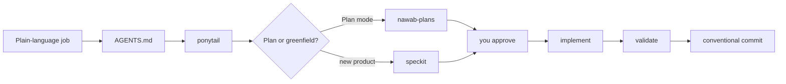

<p align="center">
  
</p>

<h1 align="center">
  
</h1>

<p align="center">
  <strong>The first portable engineering lab for Cursor.</strong>
</p>

<p align="center">
  <a href="#quick-start"><b>Quick start</b></a> ·
  <a href="#try-these-prompts"><b>Try these prompts</b></a> ·
  <a href="docs/EXTENSIVE.md"><b>Internals</b></a>
</p>

> Full internals (every package, file map, how the repo runs): [Extensive README](docs/EXTENSIVE.md)

Turn Cursor into a plan-then-ship engineering workflow. **42 skills**, **21 rules**.

Describe the feature in plain language. cursor-config-coding handles the plan, the spec, and the smallest correct diff.

> **cursor-config-coding is an engineering lab you can junction today.** It is not a PM or GTM config.
> Primary interface: a prompt in Cursor after `link-to-project.ps1`.
> Invariant: **skills name a job. They never bake a customer product.**

## Proof

This is the inventory check, not `--help`. It counts the 42 skills, the three always-on rules, and the Spec Kit pin.

```text
$ .\scripts\validate-config.ps1
ok  : skill count 42
ok  : always-on rules: ai-anti-patterns, ponytail, rule-awareness
ok  : always-on lines 51 (<= 120)
ok  : Spec Kit pin v1.0.6 in script/manifest/source
ok  : nawab PLAN.template.lite.md exists
ok  : skills have no named-gold-repo strings

validate-config: all checks passed.
```

## Try these prompts

Open a linked app in Cursor and paste:

```text
We're adding a dashboard to our Next.js App Router app.
Propose a frontend architecture: folder structure, RSC vs client
boundaries, and state. Surface trade-offs before coding.
```

```text
Design a REST API for user subscriptions with Stripe webhooks.
Use backend-architecture: service layers, idempotency, error shape.
```

```text
We need an internal agent that reads our docs and opens GitHub issues.
Use agentic-system-design: tool contracts, step limits, eval plan.
```

```text
Use product-readme. Then extensive-readme. Category landing for this
repo, internals in docs/EXTENSIVE.md. Anti-slop pass. Never invent counts.
```

## Workspace

`link-to-project.ps1` points the app's `.cursor` at this clone (Windows junction). If the app has no `AGENTS.md`, it copies `templates/AGENTS.overlay.md`. You work in the app. This lab stays one repo.

Cloud agents see the skills only after `.cursor/skills/` is in that app's git history (junction locally, or copy and commit).

## Quick start

You need two things: **Git** and **Cursor**. Junctions on Windows need Developer Mode or Administrator.

```powershell
git clone https://github.com/Vinayak-RZ/cursor-config-coding.git
cd cursor-config-coding
.\scripts\link-to-project.ps1 -Target "<absolute-path-to-your-app>"
```

Then paste one of the prompts above.

Greenfield Spec Kit (writes `.specify/` into the **app**, never into a junctioned `.cursor`):

```powershell
.\scripts\install-spec-kit.ps1 -Target "<absolute-path-to-your-app>"
```

Optional inventory check from this clone:

```powershell
.\scripts\validate-config.ps1
```

## How it works



- **Ponytail first.** The agent reads the lazy-senior ladder before it edits. Limit: it must not skip trust-boundary validation, data-loss handling, or anything you named. [ponytail](https://github.com/DietrichGebert/ponytail)
- **Nawab, sized to the work.** Plan mode loads `nawab-plans` at **lite** unless you ask for standard or project. Limit: a one-file hotfix skips nawab. This placement is local to `.cursor/skills/nawab-plans/`.
- **Spec Kit for greenfield.** constitution → specify → plan → tasks → implement. Limit: not for one-line fixes. Skills are pinned to **v1.0.6**. [Spec Kit](https://github.com/github/spec-kit)
- **Architecture on the files in front of you.** Frontend, backend, and agentic skills attach by glob; `system-design-tradeoffs` when the choice is real. Limit: only Next.js is a pre-installed stack skill. Flutter, Django, and the rest stay in the catalog.
- **Junction, don't copy.** Many apps share one `.cursor` tree. Limit: `mklink /J` is Windows. Do not run `specify init --force` against that junction.

## Field guide

| Word | Meaning here |
|------|----------------|
| Rule | Short invariant in `.cursor/rules`. Always-on is three stubs (51 lines). |
| Skill | Multi-step job in `.cursor/skills`. Fill blanks from the repo you opened. |
| Lite vs project | Lite is five plan sections. Project is the full nawab template. Do not pad lite. |
| XOR graphs | Name `graph-engineering` **or** `graph-of-loops`, never both. Neither is `graphify`. |
| README family | `product-readme` (this shape), `readable-readme` (internal service), `extensive-readme` (package map). |

## Go deeper

| Doc | What it is |
|-----|------------|
| [docs/EXTENSIVE.md](docs/EXTENSIVE.md) | Concepts, runtime path, every package and file |
| [docs/SPEC_KIT.md](docs/SPEC_KIT.md) | Spec Kit pin, `.specify/` install, skill order |
| [docs/MCP_SETUP.md](docs/MCP_SETUP.md) | Default [Agent Patterns Catalog](https://www.agentpatternscatalog.org/) MCP |
| [docs/TECH_STACK_SKILLS.md](docs/TECH_STACK_SKILLS.md) | Optional stack skills (not pre-installed) |
| [docs/INDUSTRY_PRACTICES.md](docs/INDUSTRY_PRACTICES.md) | Rules vs skills vs hooks |
| [docs/LEARNING_AND_RESEARCH.md](docs/LEARNING_AND_RESEARCH.md) | Teach-while-building |
| [skills-manifest.json](skills-manifest.json) | Machine-readable inventory |
| [AGENTS.md](AGENTS.md) | What the agent reads first in this lab |

PM / GTM work lives in [cursor-config-buisness](https://github.com/Vinayak-RZ/cursor-config-buisness). Decks and video live in [cursor-config-design](https://github.com/Vinayak-RZ/cursor-config-design).

Sync the README/copywriting skills into `~/.cursor/skills` with `.\scripts\sync-coding-skills.ps1`. Install a catalog skill into an app with `.\scripts\install-catalog-skill.ps1`.
